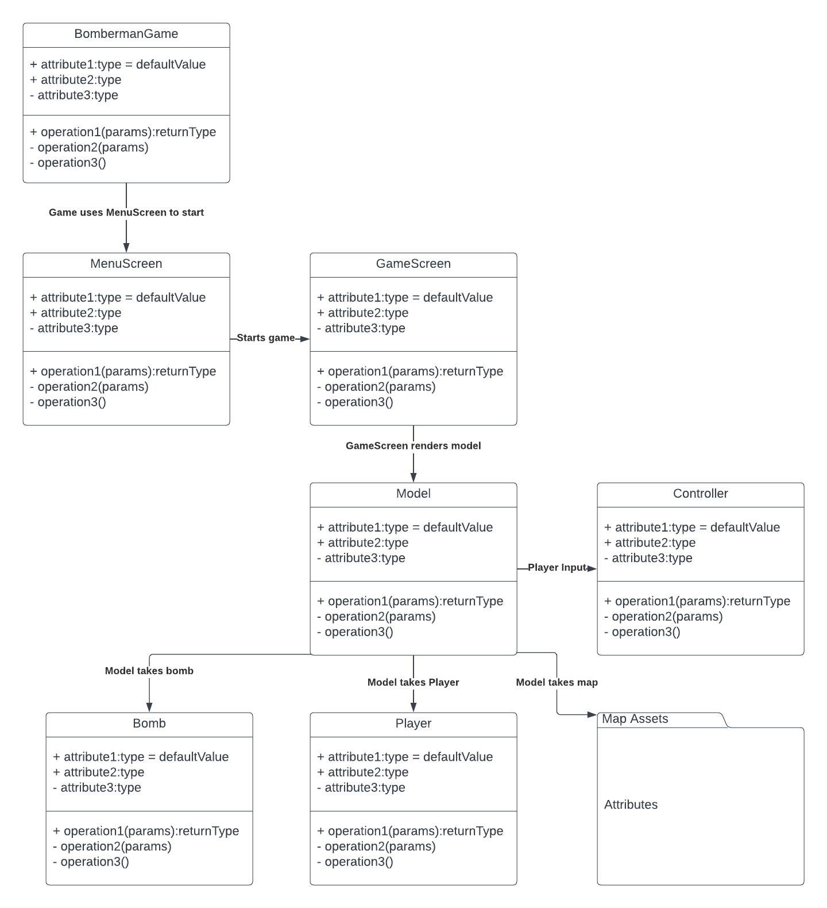

<h1> Referat 1 (20.03.2023-24.03.2023) <h1>

<h2>Hvem som var tilstede</h2>
    
 Alle var tilstede på discord 

<h2>Hva dere diskuterte</h2>
    
 Diskuterte om vi skulle møte eller ikke 

    
 Diskuterte prosjektet.  

    
 Diskuterte dersom alle hadde lært seg basic ligGDX så vil det bli enklere å begynne å dele ut individuelle oppgaver. 

<h2>Hvilke avgjørelser dere tok</h2>
    
 Ble enig om å ikke møte for å heller jobbe med oblig i et annet fag. 

    
 Ble enig om å ikke møte for å lære oss libGDX 

<h2>Hva dere ble enige om å gjøre til neste gang</h2>
    
lære oss libGDX til neste møte 

<h1> Referat 2 (01.03.2023) </h1>

<h2>Hvem som var tilstede </h2>
    
 Sebastian,Dorcas,Kjell,Brian,Jackie
<h2>Hva dere diskuterte </h2> 
    
 Diskuterte libGDX struktur og så på forskjellige implementasjoner av denne
    
 Diskuterte tileMap
    
 Diskuterte branches og hvordan vi ville ha den generelle strukturen på disse
<h2>Hvilke avgjørelser dere tok </h2>
    
 Gjorde avgjørelsen å heller bruke tileMap istedet for egenlagt grid
    
 Gjorde avgjørelsen å slette en del branches som ikke var nødvendig lengre
<h2>Hva dere ble enige om å gjøre til neste gang </h2>
    
Ble enige om å lære oss tileMap og libGDX videre

<h1>Referat 3 (02.03.2023) </h1>

<h2>Hvem som var tilstede </h2>
    
 Alle var tilstede

<h2>Hva dere diskuterte </h2>
    
 Diskuterte forståelse av tilemap samt libGDX. 

    
 Så på forskjellige .TMX maps, dette er maps som kan lages i et eget program "tiled" https://www.mapeditor.org/

    
 Diskuterte gruppe struktur

    
 
        Diskuterte UML diagram for MVP link finnes her :
        <a href= "https://lucid.app/lucidchart/f14609ae-0436-4114-be3e-44bea107c7d8/edit?viewport_loc=-459%2C-342%2C2368%2C1366%2C0_0&invitationId=inv_e2e85f81-6baa-4527-95c4-17773a7c75f0"> UML Diagram</a>
    
 
    
    
 Diskuterte plan for implimentering av MVP 

<h2>Hvilke avgjørelser dere tok </h2>
    
 Vi droppet gruppeleder struktur, beholdt kundeveileder 

    
 Vi ble enig om å begynne med implementasjon av klasser rundt model, så binder vi alt sammen ved neste møte. 
 
<h2>Hva dere ble enige om å gjøre til neste gang </h2>
    
 Brain : MenuScreen 

    
 Sebastian : GameScreen/Model 

    
 Jackie : Controller

    
 Eivind : Player/Bomb 

    
 Kjell, Dorcas : MapAssets 

